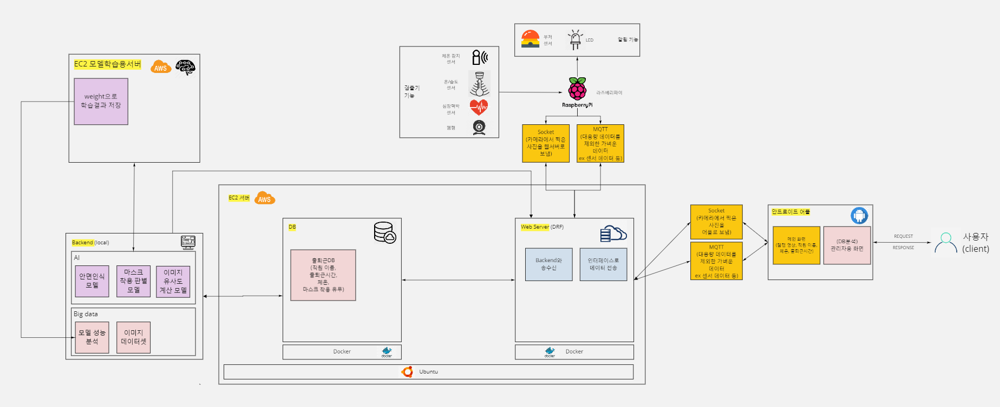

# deeptector

> **IoT, AI, Cloud, Big Data 기반의 회원 건강을 관리하는 안면인식 헬스장 출입 시스템**

 영상을 촬영했을 때, 안면인식을 통하여 회원을 구별하여 개인정보 (이름, 출입날짜 및 시간, 체온, 심박수)와 마스크 착용/미착용 여부를 화면에 출력한다. 만약에 체온이 37.5도 이상으로 높거나, 마스크 미착용시 부저와 LED에서 경고가 발생한다. DB에 저장된 데이터를 분석하여 인바디 결과를 시각적으로 보여준다. 예를 들어, 인바디 결과를 통해 최적의 운동루틴을 제공한다. DB에 저장된 데이터를 분석하여 방문횟수와 요일별 이용시간을 보여준다.

1. 필수 기능/ 포함 기술

   |           | Cloud                                                        | IoT                                                          | AI                                                           | Big Data                                                     |
   | --------- | ------------------------------------------------------------ | ------------------------------------------------------------ | ------------------------------------------------------------ | ------------------------------------------------------------ |
   | 필수 기능 | •EC2(가상환경) 환경설정하기(AWS EC2)  •데이터를 전달받는 DRF(Django Framework) 구축  •MSA 방식으로 해당되는 (backend) 이미지를 push 받아  배포(docker)  •앱 인터페이스 개발 (React Active)  •(미정) Mongo DB 자동화 관리(AWS S3) | •라즈베리파이 내 여러 기기를 제어할 수 있는 라이브러리를 설치하기  •라즈베리파이에서 웹캠 사용을 위한 환경을 설정하기  •영상 자료를 업로드할 장고 웹서버(REST 프레임워크) 개발하기 | •얼굴인식 (opencv 사용)  •이미지 분류 (ImageOps 사용)  •이미지 유사도 계산 (face_recognition/SVM  사용)  •마스크 착용 유무 판별기 (cvlib 사용)  •마스크 쓴 얼굴 인식 기반 출퇴근 기록 (이름, 출퇴근 날짜 및 시간, 체온) | •마스크 유무에 따른 이미지 파일 수집, 전처리 (Selenium)  •모델 수립을 위한 변수 분석 및 정확도 향상 (Python, R)  •Maria/Mongo DB 활용 회원 데이터베이스 구축하기 (동적 데이터베이스 구축) |
   | 포함 기술 | •클라우드 인프라 운영     - ec2, docker, s3  •인터페이스 개발     - react  •Backend설계     - DRF  •데이터베이스     - Mongo DB | •IoT 통신     - mqtt, 시리얼 통신, http(웹  서버와 안드로이드 간 통신)  •웹 서버 개발을 위한 프레임워크 설치     - REST Framework  •여러 기기 제어를 위한 라이브러리 설치(라즈베리파이)  • | •이미지 프로세싱을 하기 위한 필요한 기술     - opencv, cvlib, ImageOps  •전이학습 (Transfer Learning) 이용하여  마스크 착용 유무 분류기로 훈련     - opencv, svm, cvlib 사용  •평가 지표 시각적으로 표현      - matplotlib | •이미지 분석     - CNN, dlib  •성능 분석  •상관관계 분석  •웹 크롤링     - Selenium  •데이터베이스     - Maria/Mongo DB     - MySQL |

2. 아키텍처

   

# 문서

- `deeptector/face-mask-detector` 에서 프로젝트 수행
- `CommitMessage_Rule.md` 파일을 읽고 commit 해주세요
- `Notion` 에서 작업공유
- 시연영상 : https://youtu.be/peRxCWrm8Mg
- `branch`
  - master : 검증된 프로젝트 (develop에서 검증되면 merge)
  - develop : 각자 개발한 프로젝트 commit

# 팀

**딥텍터**

전대영(팀장), 김보라, 이원용, 이예찬, 정하늘, 조재언